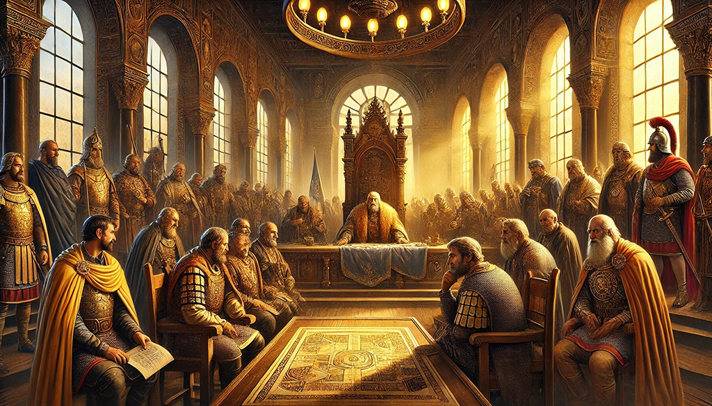

# Byzantine Generals Game 🛡️👑
Welcome to the Byzantine Generals Game—a strategic journey through loyalty, betrayal, and the art of persuasion!

In a kingdom on the brink of war, you are the King. Your mission? Unite your generals, outsmart traitors, and secure victory. But beware: every decision carries the weight of empire.

## What You Can Do:

**Influence Loyalty:** Engage with your generals to sway their allegiance.

**Track Stats:** Monitor the balance of loyalty and betrayal across rounds.

**Adapt Strategy:** Decide whether to push forward or retreat based on evolving dynamics.

**Command the Final Call:** Make the ultimate decision to attack or retreat, knowing the fate of your reign hangs in the balance.

## How It Works:
- Begin by issuing your initial order: Attack (A) or Retreat (R).
- Navigate persuasion rounds, where each interaction could turn a traitor into a loyalist—or vice versa.
- Analyze loyalty statistics after every round to refine your strategy.
- Decide whether to continue persuading or finalize your decision.

Are you ready to test your leadership in a world where trust is fleeting, and betrayal lurks in every shadow? ⚔️ Step into the council of generals and let the game begin!

*"Only the boldest leaders thrive where betrayal whispers and alliances tremble. Will you rise to the challenge?"*

