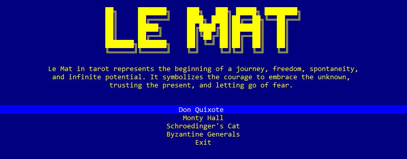

# Le Mat: Mathematical Curiosities and Logical Dilemmas
**Le Mat** is a project that combines mathematical curiosities and logical dilemmas inspired by mythology, popular culture, and scientific concepts. Its goal is to transform these ideas into entertaining algorithms, appealing to both programmers and anyone interested in mathematical challenges and logic.

## **Overview**

Le Mat brings together a series of games and thought experiments designed to explore mathematical and logical concepts through algorithms. Each game offers a fun experience to reflect on classic dilemmas or experiment with mathematical ideas in code.  

### Available Games:

1. **Don Quixote**  
   An algorithm that explores the concept of memory overflow. This is not a traditional game but rather a challenge for programmers who enjoy experimenting with its implementation.

2. **Monty Hall**  
   Based on the famous TV show *Let’s Make a Deal*. The player must choose one of three doors and discover whether their decision maximizes the chances of winning.

3. **Schrödinger’s Cat**  
   Inspired by the thought experiment by physicist Erwin Schrödinger, this game illustrates the behavior of quantum superposition.

4. **The Byzantine Generals**  
   A thought experiment that addresses the problem of coordination among independent units in an insecure environment, aiming to achieve consensus.

## **Technology Used**

- **Language:** C#  
- **Framework:** .NET  
- **Architecture:** SOLID principles  

Le Mat's design prioritizes modularity and scalability, enabling easy integration of new games or adaptations.

## **Project Structure**

Le Mat organizes all games into a simple menu that serves as a central access point for the various algorithms. Its design follows SOLID principles to ensure clean, extensible, and decoupled code.

### Key Features:
- **Adapters and Factories:**  
  These ensure compatibility with C# libraries while maintaining each game's independence and unique structure.
  
- **Project Referencing:**  
  Instead of importing projects, references are used to enhance performance and compilation.

- **Frontend Flexibility:**  
  The project supports multiple frontend technologies, such as ASP.NET MVC, Windows Forms, Console, or Blazor. For technologies like PHP, Angular, or React, an API with appropriate endpoints will be required.

> A practical example of how to develop an API using these principles can be found in my project: [**File Upload SOLID**](https://github.com/provca/SOLID_FileUploadSample)

## **Getting Started**

1. **Navigation:**  
   Use the **up/down arrows** to navigate through the menu.  

2. **Selection:**  
   Press **Enter** to access the desired game.  

3. **Enjoy the Challenge:**  
   Follow the on-screen instructions to interact with each game and explore its concepts.

## **Future Improvements**

- Development of a complete API to facilitate the integration of external frontend technologies.  
- Expansion of the game library, adding more mathematical and logical dilemmas.  
- System performance optimization for handling large data volumes and concurrent users.

## **Contributions**

Contributions are welcome! If you have ideas for new games, improvements to the code, or enhancements to the project structure, feel free to create a pull request or open an issue.

Thank you for your interest in **Le Mat**! This project is a tribute to curiosity and mathematical creativity. Enjoy exploring and learning.